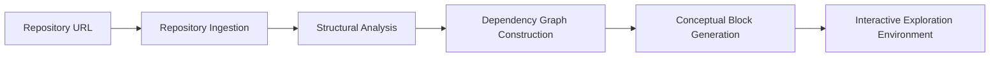

# Forge

> **Forge** is a computationally-mediated repository interpretation framework whose primary objective is the transformation of arbitrary production-grade software systems into discretized epistemic traversal units (hereafter referred to as **blocks**) arranged within a sequentially navigable explanatory topology.

Rather than presenting developers with the undifferentiated surface area of a large repository—comprising thousands of files, implicit architectural conventions, and partially documented operational assumptions—Forge attempts to algorithmically surface the latent structural intentionality embedded within the system and externalize it as a structured interpretive pathway.

In practical terms, Forge does not merely summarize a repository. Instead, it recontextualizes the codebase into a staged progression of conceptual explanations intended to approximate the mental model that an experienced engineer might construct after extended interaction with the system.

---

## Table of Contents

- [Conceptual Orientation](#conceptual-orientation)
- [Problem Context](#problem-context)
- [Operational Pipeline](#operational-pipeline)
- [System Capabilities](#system-capabilities)
- [Interface Surfaces](#interface-surfaces)
- [Intended Practitioner Groups](#intended-practitioner-groups)
- [Strategic Objectives](#strategic-objectives)
- [Technology Stack](#technology-stack)
- [Repository Layout](#repository-layout)

---

## Conceptual Orientation

Forge operates on the premise that most repositories contain an implicit architectural narrative that is rarely articulated explicitly.

Instead, that narrative is distributed across:

- file hierarchies
- naming conventions
- module boundaries
- dependency relationships
- undocumented assumptions

Developers typically reconstruct this narrative manually through prolonged exposure to the codebase.

Forge attempts to algorithmically derive a representation of that narrative and expose it through a sequence of **conceptual blocks**.

Each block represents a bounded explanatory context describing a portion of the system’s architecture.

Typical block contents include:

| Element | Description |
|--------|-------------|
| **Conceptual Objective** | The architectural idea the block attempts to clarify |
| **Narrative Explanation** | AI-generated interpretive description |
| **Relevant Files** | Source artifacts associated with the concept |
| **Dependency Diagram** | Visualization of component relationships |
| **Exploration Prompts** | Suggested questions for further investigation |

The resulting collection of blocks forms a **repository-specific architectural storyboard**.

---

## Problem Context

The process by which engineers familiarize themselves with large software systems is rarely formalized.

Instead, developers often rely on a mixture of:

- fragmented documentation
- exploratory debugging
- Slack conversations
- ad-hoc code reading
- institutional memory

This informal process tends to produce several predictable inefficiencies.

<details>
<summary>Common Organizational Outcomes</summary>

- Extended onboarding periods before meaningful contribution becomes possible  
- Architectural understanding concentrated among a small number of senior engineers  
- Repeated explanation cycles for new contributors  
- Gradual loss of system knowledge when experienced engineers leave the organization  

</details>

Forge attempts to mitigate these conditions by transforming the repository itself into a structured explanatory artifact.

---

## Operational Pipeline

When a repository is submitted to Forge, the system executes a sequence of interpretive stages.



The stages can be summarized as follows:

1. The repository is cloned and persisted for analysis.  
2. Structural inspection derives module and symbol relationships.  
3. A dependency graph representing system interactions is constructed.  
4. A language model synthesizes a sequence of explanatory blocks.  
5. The blocks are presented within an interactive exploration interface.

---

## System Capabilities

### Repository Ingestion

Forge accepts any Git-accessible repository.

During ingestion the system will:

- clone the repository
- persist repository artifacts
- memoize previously analyzed commits

---

### Structural Decomposition

Forge constructs an internal structural model of the repository using **abstract syntax tree analysis**.

This process identifies:

- modules
- exported symbols
- dependency relationships
- cross-file references

The resulting structural graph becomes the basis for subsequent explanation generation.

---

### Conceptual Block Generation

Using the structural graph as contextual input, Forge synthesizes a sequence of **5–10 explanatory blocks**.

Each block attempts to capture:

- a meaningful architectural concept
- the implementation artifacts responsible for that concept
- the relationships between relevant system components

Blocks are ordered according to dependency structure rather than file layout.

---

### Interactive Exploration

The Forge interface exposes a workspace designed to resemble a lightweight development environment.

Developers are presented with:

- a hierarchical repository explorer
- a read-only source viewer
- a conceptual storyboard panel

Users may traverse the conceptual blocks sequentially or navigate directly to linked source files.

---

### Conversational Interface

Each conceptual block includes a contextual conversational interface.

Questions asked within this interface are evaluated relative to the specific modules associated with the block in order to reduce hallucinated responses.

---

## Interface Surfaces

The Forge interface consists of three primary panels.

| Interface Element | Function |
|------------------|----------|
| **File Explorer** | Displays repository structure |
| **Source Viewer** | Provides read-only access to source artifacts |
| **Storyboard Panel** | Displays conceptual walkthrough blocks |

The storyboard and source viewer remain synchronized so developers can inspect explanations alongside the relevant implementation.

---

## Intended Practitioner Groups

Forge is primarily intended for situations in which developers must interact with unfamiliar repositories.

Typical practitioner groups include:

- **New engineers** attempting to understand an existing codebase
- **Cross-team contributors** navigating large multi-service architectures
- **Technical leadership** seeking reproducible onboarding workflows
- **Distributed engineering teams** performing asynchronous collaboration

Forge does not replace documentation but instead attempts to provide a structured interpretive layer above the repository itself.

---

## Strategic Objectives

Forge aims to achieve several outcomes:

- reduce onboarding time for engineers
- improve comprehension of complex repositories
- preserve architectural knowledge within the codebase
- reduce reliance on informal institutional memory
- support role-specific exploration pathways

---

## Technology Stack

### Frontend

The Forge client interface is implemented using:

- Next.js  
- React  
- TypeScript  

The frontend renders the repository workspace and interactive storyboard interface.

---

### Backend

Forge runs on a serverless AWS infrastructure.

| Service | Role |
|--------|------|
| **API Gateway** | Request routing |
| **AWS Lambda** | Processing and orchestration |
| **DynamoDB** | Persistent application state |
| **S3** | Repository artifact storage |
| **Amazon Bedrock** | Generative inference |

Structural analysis is performed using **tree-sitter** to extract syntax trees and derive dependency relationships.

---

## Repository Layout

```
.
├── frontend/     # Next.js application
├── backend/      # AWS SAM infrastructure
└── PRD/          # Product documentation
```

Additional implementation details can be found in:

- `frontend/README.md`
- `backend/README.md`
- `PRD/Forge_PRD.md`

---

## Closing Note

Forge attempts to transform the process of repository comprehension from an emergent byproduct of prolonged code exposure into a structured exploratory experience mediated through algorithmically generated interpretive context.

Whether this objective is fully realized remains, to some extent, dependent upon the repository itself.
