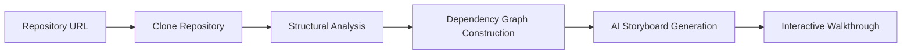

# Forge

> **Forge** is a computationally-mediated pedagogical scaffolding apparatus designed to transmute arbitrary production-grade source repositories into sequenced modular epistemic units (hereinafter referred to as **blocks**) arranged within an interactive directed walkthrough.

Rather than exposing developers to the cognitive entropy of raw repository traversal, Forge attempts to surface the latent architectural narrative embedded within the system and present it through an ordered conceptual progression.

---

## Table of Contents

- [Conceptual Overview](#conceptual-overview)
- [Motivating Context](#motivating-context)
- [Operational Model](#operational-model)
- [Functional Capabilities](#functional-capabilities)
- [Interface Model](#interface-model)
- [Intended Practitioner Groups](#intended-practitioner-groups)
- [Strategic Objectives](#strategic-objectives)
- [Technology Stack](#technology-stack)
- [Repository Layout](#repository-layout)

---

## Conceptual Overview

Forge converts an arbitrary source repository into a guided sequence of **conceptual blocks** that incrementally introduce the architectural structure of the system.

Each block typically contains:

| Component | Description |
|-----------|-------------|
| **Learning Objective** | The conceptual purpose of the block |
| **Narrative Explanation** | AI-generated description of system components |
| **Relevant Files** | Source files that anchor the explanation |
| **Diagrammatic Representation** | Visual depiction of component relationships |
| **Exploration Prompts** | Questions that guide further investigation |

The resulting sequence forms a repository-specific **architectural storyboard** that developers can traverse interactively.

---

## Motivating Context

In most engineering organizations, developers are expected to construct a mental model of a codebase through a mixture of:

- scattered documentation
- exploratory code reading
- Slack conversations
- institutional memory

This informal process often produces predictable outcomes.

<details>
<summary>Observed Organizational Effects</summary>

- Extended onboarding periods before meaningful contribution
- Dependency on senior engineers as primary knowledge sources
- Architectural understanding distributed unevenly across teams
- Institutional knowledge loss when experienced engineers leave

</details>

Forge attempts to mitigate these conditions by transforming the repository itself into a **structured explanatory artifact**.

---

## Operational Model

Forge processes repositories through several conceptual stages.



At a high level:

1. A repository is ingested
2. Structural relationships between modules are derived
3. A dependency graph is constructed
4. AI synthesizes a pedagogically ordered sequence of blocks
5. The blocks are presented through an interactive exploration interface

---

## Functional Capabilities

### Repository Ingestion

Forge accepts any Git-accessible repository.

During ingestion the system will:

- clone the repository
- persist artifacts to storage
- memoize previously analyzed commit hashes

---

### Structural Decomposition

Forge constructs a structural model of the repository through **abstract syntax tree analysis**.

This allows the system to identify:

- modules
- exported symbols
- dependency relationships

---

### Storyboard Generation

Using the derived dependency graph as context, Forge generates **5–10 explanatory blocks** describing the repository architecture.

Each block attempts to:

- explain the conceptual role of a system component
- link directly to relevant source files
- visualize relationships between modules

---

### Interactive Exploration

The Forge interface exposes a workspace composed of:

- a hierarchical file explorer
- a read-only source viewer
- a storyboard panel containing explanatory blocks

Developers may traverse blocks sequentially or navigate directly to linked source files.

---

### Conversational Assistance

Each block also includes a contextual conversational interface.

Questions asked within a block are constrained to the block’s relevant modules and dependencies in order to reduce hallucinated responses.

---

## Interface Model

The Forge interface resembles a lightweight development workspace.

| Panel | Purpose |
|------|--------|
| **File Explorer** | Navigate repository structure |
| **Source Viewer** | Inspect implementation |
| **Storyboard Panel** | Follow conceptual walkthrough |

The storyboard panel and source viewer remain synchronized so developers can inspect explanations alongside the corresponding source files.

---

## Intended Practitioner Groups

Forge is designed primarily for:

- **New engineers** attempting to understand unfamiliar repositories
- **Cross-team developers** working within large multi-service systems
- **Engineering leadership** seeking reproducible onboarding workflows
- **Distributed teams** performing asynchronous collaboration

---

## Strategic Objectives

Forge aims to:

- reduce onboarding time for new contributors
- improve comprehension of large codebases
- preserve architectural context within the repository itself
- provide role-specific learning pathways for developers

---

## Technology Stack

### Frontend

- Next.js
- React
- TypeScript

The frontend implements a workspace layout consisting of:

- file explorer
- source viewer
- storyboard interface

---

### Backend

Forge runs on a serverless AWS infrastructure.

| Service | Role |
|--------|------|
| **API Gateway** | Request routing |
| **AWS Lambda** | Processing and orchestration |
| **DynamoDB** | Persistent application state |
| **S3** | Repository artifact storage |
| **Amazon Bedrock** | Generative inference |

Repository structure is analyzed using **tree-sitter** to extract syntax trees and derive module relationships.

---

## Repository Layout

```text
.
├── frontend/     # Next.js application
├── backend/      # AWS SAM infrastructure
└── PRD/          # Product documentation
```

Additional implementation details can be found in:

- `frontend/README.md`
- `backend/README.md`
- `PRD/Forge_PRD.md`
